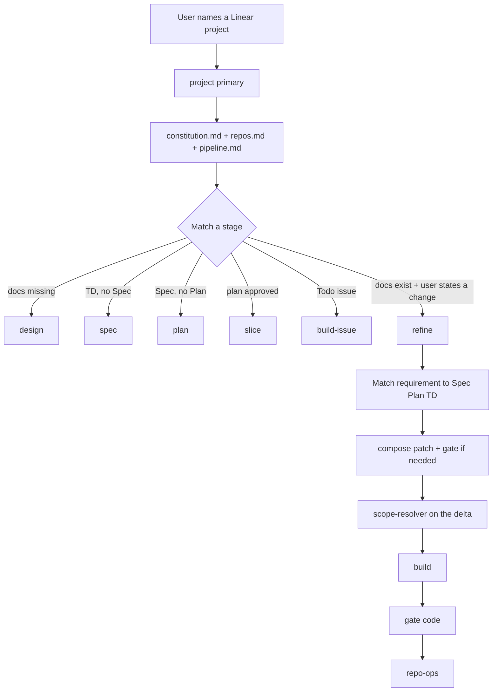

# Agentic Dev Workflow — Orchestration

Three files are the source of truth. Agent markdown is roles, not procedures.

| File | What it is |
|---|---|
| [`constitution.md`](constitution.md) | Principles, status line, 3-round cap, question kinds, doc remits |
| [`repos.md`](repos.md) | The only repo list: paths, commands, git, integration surface |
| [`pipeline.md`](pipeline.md) | Declared stages: needs, run, produces, stop_for |

The `project` primary reads Linear, matches a row in `pipeline.md`, and interprets it. Subagents never talk to the user or Linear.

## Agents

| Agent | Mode | Tier | Steps | Role |
|---|---|---|:---:|---|
| `project` | `primary` | C | — | Interprets the pipeline; talks to the user and Linear |
| `investigate` | `subagent` | C | 6 | One repo: `before-spec` or `after-spec` |
| `compose` | `subagent` | A-gen | 6 | `td` / `spec` / `plan` / `patch` |
| `gate` | `subagent` | A-gate | 8 | `design` / `code` / `patch` |
| `slice` | `subagent` | A-gen | 5 | Vertical slices → Linear-ready issues |
| `scope-resolver` | `subagent` | C | 8 | Excerpts → checklist + handoff contracts |
| `build` (built-in) | `all` | Exec | 15 | Writes code for one repo leg |
| `repo-ops` | `subagent` | C | 3 | One git/gh action per call |

`project` may delegate only to the names in its `permission.task` allowlist. `build` has all tools — “don’t touch git” is a per-invocation rule plus `gate` mode `code` checking stray git state. `repo-ops` is the only *enforced* git surface.

## Stages (summary)

Declared in full in [`pipeline.md`](pipeline.md):

- **design** — investigate both repos, compose a Technical Design from the template, gate against real code, post.
- **spec** — compose a repo-agnostic Spec from WWW / Pitch / Solution Brief only (never the Technical Design).
- **plan** — investigate, compose a cross-repo Plan, doc-sync if a late answer changes Spec or TD.
- **slice** — only after a real yes. Issues are scope + named references. No whole-plan implementation if this is skipped.
- **build-issue** — next Todo issue only. Hand over named Spec/Plan/TD *sections*, not the whole Plan. Legs sequential. Doc-sync every decision. Land via `repo-ops`. Never Done.
- **refine** — after a build, when the user states UX / “it doesn’t work”. Always match the requirement to Spec / Plan / TD, patch them if silent or wrong, then implement **only that delta**. Do not re-slice the whole project for a small tweak. Ask before slicing if it is clearly a new feature.

## Configuration

[`opencode.json`](../opencode.json) at the **workspace root** (not inside `.opencode/`):

- Linear MCP (remote, OAuth).
- `agent.build.mode: "all"` — load-bearing. Without it `project` cannot delegate code-writing.
- Every agent's model. Agent markdown files have no `model:` line.

OpenCode reads an `agent` block from `.opencode/opencode.json` but silently ignores other top-level keys there. Check with `opencode debug config`.

Permission maps: **later rules override earlier ones**, so `"*": deny` must be listed **first** in an allowlist. Verify with `opencode debug agent <name>`.

## Step budgets

One step is one model turn, not one tool call. Primaries have no step cap (the 3-round loop cap in the constitution bounds them). At the step limit OpenCode removes tools and asks for a summary — that is why every subagent opens with `status: COMPLETE` or `INCOMPLETE`, and why INCOMPLETE is a failed run.

## Model policy

Assigned only in [`opencode.json`](../opencode.json).

| Tier | Model | Who | Why |
|---|---|---|---|
| **A-gen** | `opencode-go/mimo-v2.5-pro` | `compose`, `slice` | Hardest generative work — the documents everything else is derived from |
| **A-gate** | `opencode-go/qwen3.7-plus` | `gate` | Different family from A-gen, so it does not rationalize the draft it is checking |
| **Exec** | `opencode-go/mimo-v2.5` | `build` | Code-writing. Kept off Qwen so the code gate stays cross-family |
| **C** | `opencode-go/mimo-v2.5` | `project`, `investigate`, `scope-resolver`, `repo-ops` | Orchestration, investigation, mechanical work |

`small_model` is `mimo-v2.5`. No top-level `model` — that would change everyday direct use.

## Skills

[`apply-pr-comments`](skills/apply-pr-comments/SKILL.md) is not a second pipeline. It triages review comments, then:

- commits and pushes only by invoking `repo-ops`
- runs doc-sync (`compose` / `gate` mode `patch`) for behaviour-changing comments before the code change

## Out of scope

- Automatic Linear-mention triggers.
- Patching WWW / Pitch / Solution Brief. A decision that contradicts the Solution Brief is asked, never patched into it.
- Merging. `project` opens a PR and stops.
- Clamping built-in `build`'s tools in `opencode.json` (that would also restrict everyday `build`). The boundary is the scope contract + `gate` git-state check.
- `{file:...}` prompt interpolation as a hard dependency. Agents **Read** the three declared files at the start of a run.
