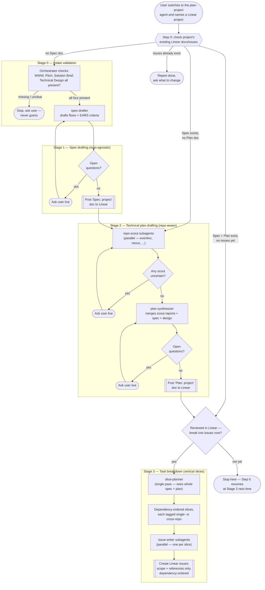
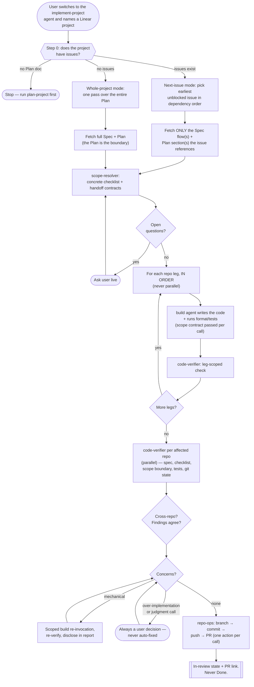

# Agentic Dev Workflow — Orchestration

This directory holds two independent OpenCode primary agents covering the early, human-collaborative part of the dev pipeline (`... -> Planning -> Implementation`, with `Clarification`/`Validation` to follow later, currently out of scope):

- **`technical-design`** — drafts one of the four docs a Linear project needs (WWW, Pitch, Solution Brief, Technical Design), by investigating `eventinc` and `nexus` together with you and checking the result against the real code before finalizing.
- **`plan-project`** — once all four docs exist, turns them into a fully-resolved spec, a fully-resolved cross-repo technical plan, and a dependency-ordered set of vertical-slice Linear issues.

They're intentionally standalone today — no automatic hand-off between them. Run `technical-design` first if the Technical Design doc doesn't exist yet; run `plan-project` once it does. Both follow the same spec-driven discipline: every ambiguity is surfaced as an explicit question and resolved live, in conversation, before anything is posted to Linear — never guessed, never deferred.

Both are `mode: primary` OpenCode agents, not slash commands — Tab-cycle into one (or your configured `switch_agent` keybind), then name or link a Linear project. Each re-inspects that project's existing Linear docs/issues every time you engage it, so there's no separate "continue" step to remember.

## `technical-design`

Investigation (`design-scout`, per repo) and drafting (`design-drafter`) mirror `plan-project`'s own two-phase shape. What's new here: a **feasibility gate** at the end. `design-verifier` re-reads the *finished* draft against each affected repo's actual current code — schemas, cross-domain rules, naming/UI, and (if both repos are involved) each side's half of the integration claim — and any conflict it finds goes back to you as a decision, never a silent fix. A decision loops back into a redraft and a re-verify, repeating until verification is clean or you explicitly accept a named tradeoff.

Both `design-scout` and `design-verifier` are told about a concrete, already-built integration surface so they check reality first instead of assuming new plumbing is needed: nexus's `Nexus.ESB.Legacy` context (`lib/nexus/esb/legacy/`) mirrors eventinc's models for nexus-side reads, and eventinc's `app/controllers/nexus/` exposes `/nexus/*` endpoints (`authenticate`, `signed_url`, `navigate`) for session/navigation handoff the other way. Whenever a design touches both repos, `design-drafter` is required to write an explicit "Cross-repo Integration" section — even when the answer is "the existing surface already covers it."

The template itself lives at [`templates/technical-design-template.md`](templates/technical-design-template.md) as a plain, hand-maintained file (Linear's *document* API can't reach workspace *templates*, and the settings page is behind auth) — edit it any time to change what `technical-design` produces, no agent file needs to change.

## `plan-project`

`plan-project` is the sole orchestrator for its own flow — it owns every Linear read/write and every conversation with you; its five subagents never touch Linear or talk to you directly, they're pure reasoning agents fed content and returning a draft plus open questions. Spec drafting (`spec-drafter`) is repo-agnostic and fully resolved before technical planning (`repo-scout` × N in parallel, then `plan-synthesizer`) starts. Task breakdown deliberately runs `slice-planner` once over the *whole* plan (not fanned out) so a slice needing both `eventinc` and `nexus` stays one issue, then `issue-writer` fans out safely per slice since they're independent by then. Issues themselves carry only scope and a precise pointer to the relevant Spec/Plan sections — never the acceptance criteria or execution steps themselves, so the docs stay the single source of truth and an issue can't go stale if a doc is revised later.

## `implement-project`

Where the other two pipelines stop at reasoning, this one writes code — so the design is mostly about bounding it. Three mechanisms do that. **Scope is bounded by what's fetched**: in next-issue mode the orchestrator follows the issue's References and fetches only those named Spec/Plan sections, so the full Plan never reaches the thing writing code — it structurally can't implement a neighbouring issue's work from a document it never saw. **`code-verifier` weights over-implementation exactly as heavily as missing work**, since code that quietly does a later issue's job makes this issue un-reviewable and steals the next one's scope. And **legs run sequentially, never in parallel**, with each later leg receiving the handoff contract the earlier one *reported actually building* rather than the contract the plan predicted.

Code-writing delegates to OpenCode's built-in **`build`** agent rather than a custom implementer — no coding prompt to maintain here. The tradeoff is stated plainly: `build` has all tools enabled, so "don't touch git, `repo-ops` lands the work" is a rule it's told per invocation, not a wall it hits. `code-verifier` checks for stray git state as the backstop. `repo-ops` holds the only *enforced* git surface (a `bash` allowlist, one action per call) and is the sole agent that can commit, push, or open a PR.

The repair loop has a narrow auto-fix lane: clear-cut mechanical defects (lint, a missing mandated test, a value the acceptance criterion states outright) are fixed in a scoped re-invocation and still named in the final report — auto-fixed means disclosed, not invisible. Everything else, and every over-implementation finding without exception, is a decision for the user. Landing goes through each repo's real convention (they differ genuinely — nexus uses Karma commits and has a PR template; eventinc doesn't), with nexus's auto-merge checkbox always left unchecked and eventinc's tribe labels surfaced as a manual step rather than guessed. An issue never reaches Done through this pipeline; Done means merged, which is a human action.

## Agents at a glance

| Agent | Mode | Tier | Used by | Role | Notable permissions |
|---|---|---|---|---|---|
| `technical-design` | `primary` | C | — (entry point) | Orchestrates Technical Design drafting end to end | `edit`/`bash` denied |
| `design-scout` | `subagent` | C | `technical-design` | Early investigation: candidate areas + design questions, per repo | Only `read`/`glob`/`grep` allowed, with `plan-project`'s `repo-scout` |
| `design-drafter` | `subagent` | **A-gen** | `technical-design` | Drafts/redrafts the doc per the template | `edit`/`bash`/`task`/`webfetch`/`websearch` denied |
| `design-verifier` | `subagent` | **A-gate** | `technical-design` | Late feasibility gate: draft's claims vs. real code, per repo | Only `read`/`glob`/`grep` allowed |
| `plan-project` | `primary` | C | — (entry point) | Orchestrates spec → plan → task breakdown end to end | `edit`/`bash` denied |
| `spec-drafter` | `subagent` | **A-gen** | `plan-project` | Drafts the repo-agnostic spec | `edit`/`bash`/`task`/`webfetch`/`websearch` denied |
| `repo-scout` | `subagent` | C | `plan-project` | Judges one repo's relevance to the spec + Technical Design | Only `read`/`glob`/`grep` allowed |
| `plan-synthesizer` | `subagent` | **A-gen** | `plan-project` | Merges scout reports into the cross-repo plan | Same restricted set as `spec-drafter` |
| `slice-planner` | `subagent` | **A-gen** | `plan-project` | Single-pass vertical-slice breakdown | Same restricted set as `spec-drafter` |
| `issue-writer` | `subagent` | C | `plan-project` | Formats one slice into a scope-only Linear issue (references Spec/Plan, never restates them) | Same restricted set as `spec-drafter` |
| `implement-project` | `primary` | C | — (entry point) | Orchestrates next-issue or whole-project implementation end to end | `write`/`edit`/`patch`/`bash` tools off |
| `scope-resolver` | `subagent` | C | `implement-project` | Resolves scope + references into a concrete, ordered checklist with cross-repo handoff contracts | Read-only: keeps `read`/`glob`/`grep`/`list`, everything else off |
| `build` (built-in) | `all` | C | `implement-project` | Writes the actual code for one repo leg | **All tools enabled** — the one unrestricted agent; bounded by prompt + verifier, not permissions |
| `code-verifier` | `subagent` | **A-gate** | `implement-project` | Checks code vs. spec, checklist, and scope boundary — over- and under-implementation weighted equally | Read-only, `bash` off — so it never re-runs tests, only judges the report |
| `repo-ops` | `subagent` | C | `implement-project` | Sole git/GitHub surface: branch, commit, push, PR — one action per call | **Only agent with `bash`**, via a git/gh allowlist; `write`/`edit`/`patch` off |

## Model policy

Every agent's model is assigned in one place — [`opencode.json`](opencode.json). Agent markdown files deliberately carry no `model:` line, so there's no precedence question: the JSON is the only place models are set, and re-tiering an agent is a one-line edit there.

| Tier | Model | Agents | Why |
|---|---|---|---|
| **A-gen** | `opencode-go/mimo-v2.5-pro` | `spec-drafter`, `plan-synthesizer`, `slice-planner`, `design-drafter` | The hardest generative reasoning — the documents everything downstream is derived from. Each runs once per stage, so the cost is bounded. |
| **A-gate** | `opencode-go/muse-spark-1.2-contributor` | `design-verifier`, `code-verifier` | Adversarial verification, deliberately a *different family* from whatever produced the work — a verifier running the same model that wrote the thing tends to rationalize its mistakes rather than catch them. |
| **C** | `opencode-go/mimo-v2.5` | `technical-design`, `plan-project`, `implement-project`, `design-scout`, `repo-scout`, `scope-resolver`, `issue-writer`, `repo-ops`, `build` | Everything else: orchestration, code investigation, code-writing, and mechanical work. |

**The A-gen / A-gate split runs in this direction on purpose.** Drafting gets MiMo Pro and validation gets Muse Spark, so both gates stay cross-family: `code-verifier` (Muse Spark) checks code written by `build` (MiMo), and `design-verifier` (Muse Spark) checks a draft written by `design-drafter` (MiMo Pro). Swapping them would put a MiMo verifier on MiMo-written code — exactly the self-rationalizing setup the split exists to avoid.

**Code-writing (`build`) runs on tier C by choice**, not by oversight: MiMo-V2.5 is a coding-oriented model, and the pipeline is deliberately structured so cheap generation is safe — `scope-resolver` hands it a checklist that requires no judgment calls, and `code-verifier` checks the result far more strictly than the model that produced it. Generate cheap, verify hard, repair in a loop. The corollary is that the verifier and the repair loop carry real weight here — if `build` starts needing several repair rounds per issue, moving it up a tier is a one-line change in [`opencode.json`](opencode.json).

The three primary orchestrators sit in tier C alongside the mechanical agents on purpose: they route and converse, but every judgment that matters is delegated to a tier-A subagent. `small_model` is pinned to `mimo-v2.5` too, so background work (titles, summaries, compaction) never touches the two stronger models. No top-level `model` is set — that would change the workspace default for everyday direct use, and pinning `agent.build.model` already covers code-writing.

Two things worth knowing:

- **Three models across 15 agents, deliberately.** An earlier version spread five models from five families across four tiers; it collapsed because the expensive members cost far more than the capability gap justified — `kimi-k3` at $3/$15 per Mtok, `grok-4.5` at $2/$6, and `qwen3.8-max` (Go-exclusive, unpriced publicly, but its `qwen3.7-max` sibling is $2.50/$7.50). Those prices come from OpenCode's published per-token table, not from inferring capability out of request allocations as the first cut did.
- **Fan-out multiplies spend.** `repo-scout` ×2, `design-scout` ×2, `code-verifier` ×2, and `issue-writer` ×N-slices all run per-unit, against Go's dollar-based limits ($12/5h, $30/week, $60/month). A cross-repo implementation run is the worst case — and since only six agents sit above tier C, that's where spend concentrates now. If it ever needs cutting, weaken the drafting tier before the gates.

## Design principles

- **Ask, never guess** — extends the workspace root [`AGENTS.md`](../AGENTS.md)'s existing rule to every stage: any subagent that can't confidently resolve something raises it as an explicit question instead of filling the gap.
- **Ground design in what's already built** — before assuming new plumbing is needed (a module, a domain, an integration mechanism), check what's actually there. The eventinc↔nexus integration surface (`Nexus.ESB.Legacy` / `app/controllers/nexus/`) is the concrete example baked into `technical-design`'s subagents.
- **Verify against reality before finalizing** — a design reading well isn't the same as a design being buildable. `design-verifier` re-checks the finished draft's specific technical claims against the real codebases as a last gate, and any conflict is a decision for the human, never a silent fix.
- **Spec before plan** — in `plan-project`, *what* the system does (repo-agnostic) is fully resolved before *how/where* it's built (repo-aware) is even considered.
- **Vertical slices, not layers or repos** — `plan-project`'s task breakdown slices by user-flow value; a slice spanning both repos stays one issue, never split for the sake of parallelism.
- **Reference, never duplicate** — issues carry scope and a precise pointer to the Spec/Plan sections that define the detail, never a copied excerpt or execution checklist. `issue-writer` is never even given the underlying spec/plan text, only the section names to point at — the docs remain the only source of truth, and a future implementation agent reads them directly rather than trusting anything frozen into the issue.
- **Bound scope by what you hand over** — the strongest guard against an implementation agent doing a neighbouring issue's work isn't an instruction, it's never giving it the document that describes that work. `implement-project` fetches only the Spec/Plan sections an issue references, so the full Plan never reaches the thing writing code.
- **Write power is narrow and split by kind** — `repo-ops` is the only agent with `bash`, scoped to a git/gh allowlist, and it cannot edit files; everything that reasons about code can't land it. Where a boundary is only instructed rather than enforced (the built-in `build` agent has all tools), say so out loud and give the verifier a check for it.
- **Centralized I/O** — only each primary agent talks to Linear or the user; subagents are stateless drafting/investigation functions.
- **Stateful via Linear, not via memory** — each agent's "state" is just what's already posted in Linear, so any session can resume it correctly.
- **Self-validated output** — every agent and subagent file states an explicit Goal plus a self-check checklist it must pass before returning or posting. That checklist is the actual definition of done, not just a list of steps to follow.

## Out of scope (for now)

- `Clarification` and `Validation` pipeline stages.
- Automatic hand-off from `technical-design` to `plan-project` — run them separately for now; noted as a future direction.
- Triggering either agent from a Linear mention.
- Automatic approval detection in `plan-project` (e.g. polling Linear comments) — the approval gate is a live question today.
- Merging. `implement-project` opens a PR and stops; both repos require human review (nexus: 2 approvals; eventinc: tribe labels + staging QA), and Done means merged.
- Enforcing the "code-writer must not touch git" boundary at the permission level — it's instructed per invocation, with `code-verifier`'s stray-git-state check as the backstop. Restricting the built-in `build` agent isn't narrowly possible: built-in agents are only configurable via `opencode.json`, so clamping it here would also clamp it for everyday direct use.
- A separate global `issue-implementer` pipeline exists in `~/.config/opencode/` (with `linear-issue-fetcher`, `codebase-router`, `git-ops`). It's deliberately left alone, so both it and `implement-project` are Tab-switchable — worth retiring the older one once this pipeline proves out, since its assumption that issues carry concrete steps no longer matches the issue format.
