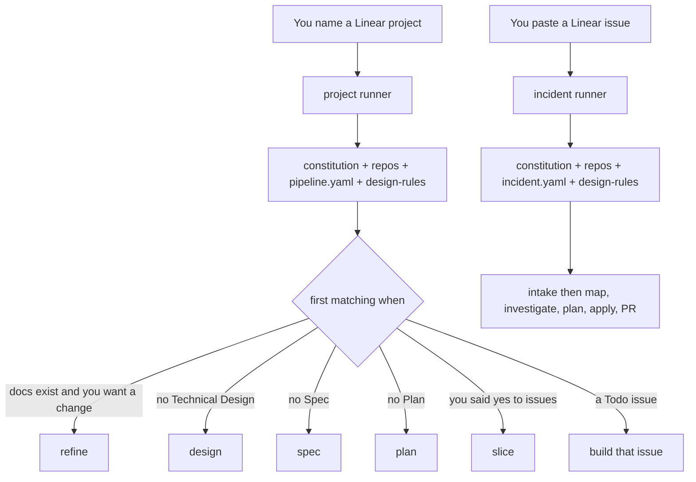

# How the pipeline is built

Declared files are the source of truth. Agent files only describe a job (goal, inputs, outputs). They do not repeat the rules. Add a design constraint in [`design-rules.md`](design-rules.md) — every stage follows that file.

| File | Role |
|---|---|
| [`constitution.md`](constitution.md) | Shared rules: ask vs look in code, status line, 3-round cap |
| [`repos.md`](repos.md) | Repos, local URLs (`3232` = eventinc, `4000` = nexus), git style |
| [`pipeline.yaml`](pipeline.yaml) | Project graph: when to run, steps, what to produce, when to stop |
| [`pipeline.md`](pipeline.md) | Short index of project stages. Points at the yaml. |
| [`incident.yaml`](incident.yaml) | Incident graph: one issue, no project. Confirm through the plan; then apply and PR. |
| [`design-rules.md`](design-rules.md) | Always-on design constraints (every stage). Add a heading to add a rule. |

The **`project`** agent reads Linear, walks [`pipeline.yaml`](pipeline.yaml), and runs the matching stage. The **`incident`** agent walks [`incident.yaml`](incident.yaml) for a standalone issue. Neither invents hops. Helpers never talk to you or to Linear.

## Agents

| Agent | Job |
|---|---|
| `project` | Talks to you and Linear. Walks `pipeline.yaml`. |
| `incident` | Talks to you and Linear. Walks `incident.yaml` for one issue, no project. |
| `investigate` | Reads one repo. |
| `compose` | Writes or patches a document. |
| `gate` | Checks a design, a patch, or the code. |
| `slice` | Turns the plan into Linear issues. |
| `scope-resolver` | Turns an issue into a checklist. |
| `build` | Writes the code (built-in OpenCode agent). |
| `repo-ops` | One git or GitHub action per call. Only this agent may touch git. |

`project` and `incident` may only call the helpers listed in their allowlists. `build` can use every tool, so it is *told* not to touch git; `gate` checks that it didn’t.

## Stages

Full detail is in [`pipeline.yaml`](pipeline.yaml). Short index: [`pipeline.md`](pipeline.md).

- **design** — look at both repos, apply every rule in `design-rules.md` (today: collect full UI/API URLs), write a Technical Design, check it against the code, post it.
- **spec** — write *what* the system does. No repos or tech. Uses WWW, Pitch, and Solution Brief only.
- **plan** — write *how* and *where*. If your answer changes the Spec or Design, those docs get patched first.
- **slice** — only after you say yes. Issues point at the docs; they do not copy them. It will not build the whole plan if you skip this.
- **build-issue** — next Todo issue only (never backlog). Builds one repo at a time. Opens a PR. Never marks the issue Done.
- **refine** — after a build, when you report UX or “it doesn’t work”. Updates Spec / Plan / Design if needed, then changes only that bit of code.

Incident stages (full detail: [`incident.yaml`](incident.yaml)): **intake** → **map-repos** → **investigate** → **plan** → **apply** → **pr**. Confirm and comment through the plan; after a green apply, open the PR without waiting. Branch from latest `origin/HEAD`.

## Config

[`opencode.json`](../opencode.json) lives at the **workspace root**, not inside `.opencode/`. It holds:

- Linear (OAuth)
- `agent.build.mode: "all"` — required, or `project` / `incident` cannot write code
- Each agent’s model

Models are only set in that file. Agent markdown has no `model:` line.

If you edit permissions: later rules win, so `"*": deny` must come **first**. Check with `opencode debug agent <name>`.

## Review comments

The [`apply-pr-comments`](skills/apply-pr-comments/SKILL.md) skill is not a second pipeline. It applies review comments, commits through `repo-ops`, and updates the docs if a comment changes behaviour.

## What it will not do

- Start from a Linear @mention
- Edit WWW, Pitch, or the Solution Brief (if a decision fights the Brief, it asks you)
- Merge the PR (that stays a human step)
- Clamp `build`’s tools in config (that would also limit everyday coding)
