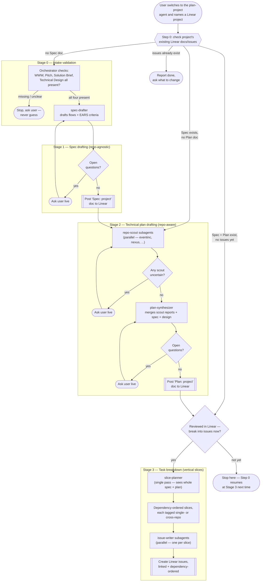

# Agentic Dev Workflow — Orchestration

This directory holds two independent OpenCode primary agents covering the early, human-collaborative part of the dev pipeline (`... -> Planning -> Implementation`, with `Clarification`/`Validation` to follow later, currently out of scope):

- **`technical-design`** — drafts one of the four docs a Linear project needs (WWW, Pitch, Solution Brief, Technical Design), by investigating `eventinc` and `nexus` together with you and checking the result against the real code before finalizing.
- **`plan-project`** — once all four docs exist, turns them into a fully-resolved spec, a fully-resolved cross-repo technical plan, and a dependency-ordered set of vertical-slice Linear issues.

They're intentionally standalone today — no automatic hand-off between them. Run `technical-design` first if the Technical Design doc doesn't exist yet; run `plan-project` once it does. Both follow the same spec-driven discipline: every ambiguity is surfaced as an explicit question and resolved live, in conversation, before anything is posted to Linear — never guessed, never deferred.

Both are `mode: primary` OpenCode agents, not slash commands — Tab-cycle into one (or your configured `switch_agent` keybind), then name or link a Linear project. Each re-inspects that project's existing Linear docs/issues every time you engage it, so there's no separate "continue" step to remember.

## `technical-design`

Investigation (`design-scout`, per repo) and drafting (`design-drafter`) mirror `plan-project`'s own two-phase shape. What's new here: a **feasibility gate** at the end. `design-verifier` re-reads the *finished* draft against each affected repo's actual current code — schemas, cross-domain rules, naming/UI, and (if both repos are involved) each side's half of the integration claim — and any conflict it finds goes back to you as a decision, never a silent fix. A decision loops back into a redraft and a re-verify, repeating until verification is clean or you explicitly accept a named tradeoff.

Both `design-scout` and `design-verifier` are told about a concrete, already-built integration surface so they check reality first instead of assuming new plumbing is needed: nexus's `Nexus.ESB.Legacy` context (`lib/nexus/esb/legacy/`) mirrors eventinc's models for nexus-side reads, and eventinc's `app/controllers/nexus/` exposes `/nexus/*` endpoints (`authenticate`, `signed_url`, `navigate`) for session/navigation handoff the other way. Whenever a design touches both repos, `design-drafter` is required to write an explicit "Cross-repo Integration" section — even when the answer is "the existing surface already covers it."

The template itself lives at [`templates/technical-design-template.md`](templates/technical-design-template.md) as a plain, hand-maintained file (Linear's *document* API can't reach workspace *templates*, and the settings page is behind auth) — edit it any time to change what `technical-design` produces, no agent file needs to change.

## `plan-project`

`plan-project` is the sole orchestrator for its own flow — it owns every Linear read/write and every conversation with you; its five subagents never touch Linear or talk to you directly, they're pure reasoning agents fed content and returning a draft plus open questions. Spec drafting (`spec-drafter`) is repo-agnostic and fully resolved before technical planning (`repo-scout` × N in parallel, then `plan-synthesizer`) starts. Task breakdown deliberately runs `slice-planner` once over the *whole* plan (not fanned out) so a slice needing both `eventinc` and `nexus` stays one issue, then `issue-writer` fans out safely per slice since they're independent by then.

## Agents at a glance

| Agent | Mode | Used by | Role | Notable permissions |
|---|---|---|---|---|
| `technical-design` | `primary` | — (entry point) | Orchestrates Technical Design drafting end to end | `edit`/`bash` denied |
| `design-scout` | `subagent` | `technical-design` | Early investigation: candidate areas + design questions, per repo | Only `read`/`glob`/`grep` allowed, with `plan-project`'s `repo-scout` |
| `design-drafter` | `subagent` | `technical-design` | Drafts/redrafts the doc per the template | `edit`/`bash`/`task`/`webfetch`/`websearch` denied |
| `design-verifier` | `subagent` | `technical-design` | Late feasibility gate: draft's claims vs. real code, per repo | Only `read`/`glob`/`grep` allowed |
| `plan-project` | `primary` | — (entry point) | Orchestrates spec → plan → task breakdown end to end | `edit`/`bash` denied |
| `spec-drafter` | `subagent` | `plan-project` | Drafts the repo-agnostic spec | `edit`/`bash`/`task`/`webfetch`/`websearch` denied |
| `repo-scout` | `subagent` | `plan-project` | Judges one repo's relevance to the spec + Technical Design | Only `read`/`glob`/`grep` allowed |
| `plan-synthesizer` | `subagent` | `plan-project` | Merges scout reports into the cross-repo plan | Same restricted set as `spec-drafter` |
| `slice-planner` | `subagent` | `plan-project` | Single-pass vertical-slice breakdown | Same restricted set as `spec-drafter` |
| `issue-writer` | `subagent` | `plan-project` | Formats one slice into a Linear issue | Same restricted set as `spec-drafter` |

## Design principles

- **Ask, never guess** — extends the workspace root [`AGENTS.md`](../AGENTS.md)'s existing rule to every stage: any subagent that can't confidently resolve something raises it as an explicit question instead of filling the gap.
- **Ground design in what's already built** — before assuming new plumbing is needed (a module, a domain, an integration mechanism), check what's actually there. The eventinc↔nexus integration surface (`Nexus.ESB.Legacy` / `app/controllers/nexus/`) is the concrete example baked into `technical-design`'s subagents.
- **Verify against reality before finalizing** — a design reading well isn't the same as a design being buildable. `design-verifier` re-checks the finished draft's specific technical claims against the real codebases as a last gate, and any conflict is a decision for the human, never a silent fix.
- **Spec before plan** — in `plan-project`, *what* the system does (repo-agnostic) is fully resolved before *how/where* it's built (repo-aware) is even considered.
- **Vertical slices, not layers or repos** — `plan-project`'s task breakdown slices by user-flow value; a slice spanning both repos stays one issue, never split for the sake of parallelism.
- **Centralized I/O** — only each primary agent talks to Linear or the user; subagents are stateless drafting/investigation functions.
- **Stateful via Linear, not via memory** — each agent's "state" is just what's already posted in Linear, so any session can resume it correctly.
- **Self-validated output** — every agent and subagent file states an explicit Goal plus a self-check checklist it must pass before returning or posting. That checklist is the actual definition of done, not just a list of steps to follow.

## Out of scope (for now)

- `Clarification` and `Validation` pipeline stages.
- Automatic hand-off from `technical-design` to `plan-project` — run them separately for now; noted as a future direction.
- Triggering either agent from a Linear mention.
- Automatic approval detection in `plan-project` (e.g. polling Linear comments) — the approval gate is a live question today.
