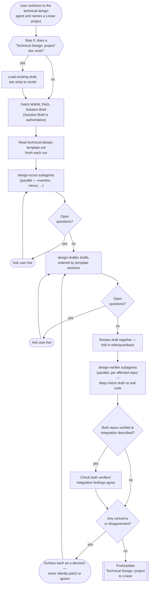
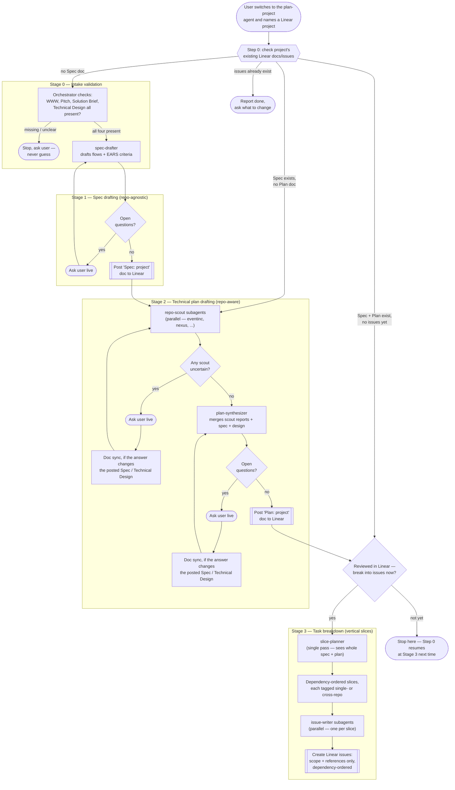
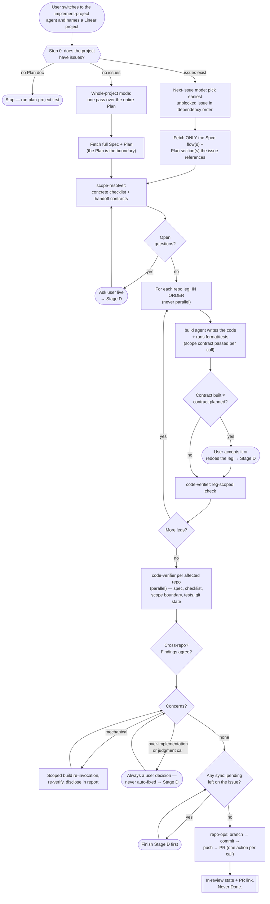
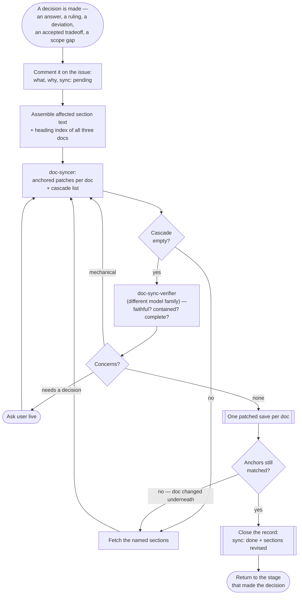

# Agentic Dev Workflow — Orchestration

This directory holds three independent OpenCode primary agents covering the dev pipeline from a rough idea to an open PR (`... -> Planning -> Implementation`, with `Clarification`/`Validation` to follow later, currently out of scope):

- **`technical-design`** — drafts one of the four docs a Linear project needs (WWW, Pitch, Solution Brief, Technical Design), by investigating `eventinc` and `nexus` together with you and checking the result against the real code before finalizing.
- **`plan-project`** — once all four docs exist, turns them into a fully-resolved spec, a fully-resolved cross-repo technical plan, and a dependency-ordered set of vertical-slice Linear issues.
- **`implement-project`** — takes the earliest unblocked issue, resolves it into a checklist, has the code written and verified against that scope, and lands it as a PR per repo.

They're intentionally standalone today — no automatic hand-off between them. Run them in that order; each checks Linear first and tells you if you're not ready for it yet. All three follow the same spec-driven discipline: every ambiguity is surfaced as an explicit question and resolved live, in conversation, before anything is posted to Linear — never guessed, never deferred.

They're `mode: primary` OpenCode agents, not slash commands — Tab-cycle into one (or your configured `switch_agent` keybind), then name or link a Linear project. Each re-inspects that project's existing Linear docs/issues every time you engage it, so there's no separate "continue" step to remember.

**The documents are the state, so they can never be allowed to go stale.** The pipeline runs forwards, but decisions don't: an answer given during technical planning can be a *spec* decision, and a decision made mid-implementation can invalidate a Plan section, a criterion and a test case at once. Every stage that produces a decision after a document was posted therefore syncs it back — `doc-syncer` writes the revision as anchored patches, `doc-sync-verifier` gates it on a different model family, and the decision follows its own cascade through all three documents until nothing is left contradicting it. That's what makes "state lives in Linear" a real claim rather than an aspiration.

## `technical-design`

Investigation (`design-scout`, per repo) and drafting (`design-drafter`) mirror `plan-project`'s own two-phase shape. What's new here: a **feasibility gate** at the end. `design-verifier` re-reads the *finished* draft against each affected repo's actual current code — schemas, cross-domain rules, naming/UI, and (if both repos are involved) each side's half of the integration claim — and any conflict it finds goes back to you as a decision, never a silent fix. A decision loops back into a redraft and a re-verify, repeating until verification is clean or you explicitly accept a named tradeoff.

Both `design-scout` and `design-verifier` are told about a concrete, already-built integration surface so they check reality first instead of assuming new plumbing is needed: nexus's `Nexus.ESB.Legacy` context (`lib/nexus/esb/legacy/`) mirrors eventinc's models for nexus-side reads, and eventinc's `app/controllers/nexus/` exposes `/nexus/*` endpoints (`authenticate`, `signed_url`, `navigate`) for session/navigation handoff the other way. Whenever a design touches both repos, `design-drafter` is required to write an explicit "Cross-repo Integration" section — even when the answer is "the existing surface already covers it."

The template itself lives at [`templates/technical-design-template.md`](templates/technical-design-template.md) as a plain, hand-maintained file (Linear's *document* API can't reach workspace *templates*, and the settings page is behind auth) — edit it any time to change what `technical-design` produces, no agent file needs to change.

## `plan-project`

`plan-project` is the sole orchestrator for its own flow — it owns every Linear read/write and every conversation with you; its five subagents never touch Linear or talk to you directly, they're pure reasoning agents fed content and returning a draft plus open questions. Spec drafting (`spec-drafter`) is repo-agnostic and fully resolved before technical planning (`repo-scout` × N in parallel, then `plan-synthesizer`) starts. Task breakdown deliberately runs `slice-planner` once over the *whole* plan (not fanned out) so a slice needing both `eventinc` and `nexus` stays one issue, then `issue-writer` fans out safely per slice since they're independent by then. Issues themselves carry only scope and a precise pointer to the relevant Spec/Plan sections — never the acceptance criteria or execution steps themselves, so the docs stay the single source of truth and an issue can't go stale if a doc is revised later.

The two `Doc sync` nodes are the back-propagation path. A repo-scout or synthesizer question is very often a *spec* question in technical clothing — "which system of record wins for partner notifications?" is answered in the Plan but decided about behaviour — and the Spec is already posted by then. Answering it only in the Plan would leave the Spec, the document acceptance is judged against, stating something the user no longer believes. So the answer is patched into whichever posted document it actually changes before Stage 2 continues. Step 0 has a matching branch in the other direction: when `implement-project` has synced decisions into the docs since the issues were cut, the issue set may no longer match the Plan, and re-slicing that delta is a `plan-project` run — never something the implementation pipeline does for itself.

## `implement-project`

Where the other two pipelines stop at reasoning, this one writes code — so the design is mostly about bounding it. Three mechanisms do that. **Scope is bounded by what's handed over**: in next-issue mode the orchestrator follows the issue's References and passes on only those named Spec/Plan sections, so the full Plan never reaches the thing writing code — it structurally can't implement a neighbouring issue's work from a document it never saw. (Linear's document API reads whole documents, so this is a bound on hand-off, not on what the orchestrator can see. The agent file says so explicitly rather than implying an isolation that doesn't exist.) **`code-verifier` weights over-implementation exactly as heavily as missing work**, since code that quietly does a later issue's job makes this issue un-reviewable and steals the next one's scope. And **legs run sequentially, never in parallel**, with each later leg receiving the handoff contract the earlier one *reported actually building* rather than the contract the plan predicted.

Code-writing delegates to OpenCode's built-in **`build`** agent rather than a custom implementer — no coding prompt to maintain here. The tradeoff is stated plainly: `build` has all tools enabled, so "don't touch git, `repo-ops` lands the work" is a rule it's told per invocation, not a wall it hits. `code-verifier` checks for stray git state as the backstop. `repo-ops` holds the only *enforced* git surface (a `bash` allowlist, one action per call) and is the sole agent that can commit, push, or open a PR.

The repair loop has a narrow auto-fix lane: clear-cut mechanical defects (lint, a missing mandated test, a value the acceptance criterion states outright) are fixed in a scoped re-invocation and still named in the final report — auto-fixed means disclosed, not invisible. A mechanical fix is explicitly *not* a decision and doesn't sync: nobody ruled on anything. The exception is a mechanical fix that was only necessary because a document was wrong — the wrongness itself is a decision, and it syncs. Everything else, and every over-implementation finding without exception, is a decision for the user, and every one of those goes through Stage D before the repair is even attempted. Landing goes through each repo's real convention (they differ genuinely — nexus uses Karma commits and has a PR template; eventinc doesn't), with nexus's auto-merge checkbox always left unchecked and eventinc's tribe labels surfaced as a manual step rather than guessed. An issue never reaches Done through this pipeline; Done means merged, which is a human action.

### Stage D, and why decisions were the leak

This is the stage where the pipeline's documents stop being planning artifacts and start being maintained. Everything upstream resolves ambiguity *before* writing anything down, which works right up until code meets reality: a criterion nobody read closely enough, a contract that had to be shaped differently once a real schema was involved, a verifier finding the user resolves by reinterpreting the spec. Those decisions used to live in exactly one place — the conversation — and the conversation ends. The docs then described a system that no longer existed, and the *next* issue got planned against them. Nothing in the pipeline would notice, because every individual run looked clean.

Every `→ Stage D` above enters the same loop, drawn separately because it's reached from four places and returns to each:

Four properties make Stage D more than a note-taking step:

- **It runs inside the stage that produced the decision**, not before landing. Decisions resolved together in one exchange sync as one batch, but a decision never crosses a stage boundary unsynced — so the checklist `scope-resolver` produces, and the contract the next leg is built against, both come from documents that already say what was just decided.
- **The record is written before the revision.** A `sync: pending` comment lands on the issue the moment the decision is made, and Step 0 of any later run looks for one. A dead session can lose the doc edit; it can't lose the decision.
- **A decision cascades.** `doc-syncer` gets the sections believed affected *plus the heading index of all three documents*, and returns a cascade list of sections it can see are implicated but wasn't shown. Those get fetched and fed back until the list comes back empty. One ruling on when a notification fires typically lands in a Spec criterion, a Plan section and a Technical Design test case — catching only the first is the failure mode this exists to prevent, so the loop doesn't terminate on the obvious hit.
- **Patches, not rewrites.** Revisions are anchored `replace`/`insert`/`replace_range` operations applied through Linear's document-patch API, so a decision touches only what it changes, the rest of the document is provably untouched, and the diff is legible in Linear's own history. Patches apply atomically per document — if an anchor no longer matches, the document changed underneath the run and that document's sections are re-fetched rather than being overwritten with stale content.

`doc-sync-verifier` gates every revision on a **different model family** from the one that wrote it, the same split used for code and design verification. It checks faithfulness (does the patch say what was decided, not a generalised or softened version), containment (is every edit traceable to the decision, or did neighbouring prose get tidied), cascade completeness (walking the heading index itself, looking for what's *missing*), internal consistency (does anything else in the document now contradict the revision), and document remit (technical detail leaking into the repo-agnostic Spec). It also checks that every anchor matches exactly once, since a bad anchor silently aborts a whole document's save.

Two boundaries are deliberate. **A sync never widens the run's scope** — writing something into the Plan doesn't authorise building it, and work a decision adds belongs to a later issue. And **`implement-project` never creates or re-slices issues**: it patches the Plan, reports that the issue set has drifted, and re-slicing stays a `plan-project` run, because slicing needs the whole picture and this pipeline deliberately never has it.

## Agents at a glance

| Agent | Mode | Tier | Steps | Used by | Role | Notable permissions |
|---|---|---|:---:|---|---|---|
| `technical-design` | `primary` | C | — | — (entry point) | Orchestrates Technical Design drafting end to end | `edit`/`bash` denied |
| `design-scout` | `subagent` | C | 6 | `technical-design` | Early investigation: candidate areas + design questions, per repo | Only `read`/`glob`/`grep` allowed, with `plan-project`'s `repo-scout` |
| `design-drafter` | `subagent` | **A-gen** | 6 | `technical-design` | Drafts/redrafts the doc per the template | `edit`/`bash`/`task`/`webfetch`/`websearch` denied |
| `design-verifier` | `subagent` | **A-gate** | 8 | `technical-design` | Late feasibility gate: draft's claims vs. real code, per repo | Only `read`/`glob`/`grep` allowed |
| `plan-project` | `primary` | C | — | — (entry point) | Orchestrates spec → plan → task breakdown end to end | `edit`/`bash` denied |
| `spec-drafter` | `subagent` | **A-gen** | 5 | `plan-project` | Drafts the repo-agnostic spec | `edit`/`bash`/`task`/`webfetch`/`websearch` denied |
| `repo-scout` | `subagent` | C | 6 | `plan-project` | Judges one repo's relevance to the spec + Technical Design | Only `read`/`glob`/`grep` allowed |
| `plan-synthesizer` | `subagent` | **A-gen** | 5 | `plan-project` | Merges scout reports into the cross-repo plan | Same restricted set as `spec-drafter` |
| `slice-planner` | `subagent` | **A-gen** | 5 | `plan-project` | Single-pass vertical-slice breakdown | Same restricted set as `spec-drafter` |
| `issue-writer` | `subagent` | C | 3 | `plan-project` | Formats one slice into a scope-only Linear issue (references Spec/Plan, never restates them) | Same restricted set as `spec-drafter` |
| `implement-project` | `primary` | C | — | — (entry point) | Orchestrates next-issue or whole-project implementation end to end | `write`/`edit`/`patch`/`bash` tools off |
| `scope-resolver` | `subagent` | C | 8 | `implement-project` | Resolves scope + references into a concrete, ordered checklist with cross-repo handoff contracts | Read-only: keeps `read`/`glob`/`grep`/`list`, everything else off |
| `build` (built-in) | `all` | **Exec** | 15 | `implement-project` | Writes the actual code for one repo leg | **All tools enabled** — the one unrestricted agent; bounded by prompt + verifier, not permissions |
| `code-verifier` | `subagent` | **A-gate** | 8 | `implement-project` | Checks code vs. spec, checklist, and scope boundary — over- and under-implementation weighted equally | Read-only, `bash` off — so it never re-runs tests, only judges the report |
| `repo-ops` | `subagent` | C | 3 | `implement-project` | Sole git/GitHub surface: branch, commit, push, PR — one action per call | **Only agent with `bash`**, via a git/gh allowlist; `write`/`edit`/`patch` off |
| `doc-syncer` | `subagent` | **A-gen** | 5 | `implement-project`, `plan-project` | Turns a decision into anchored doc patches, and names every section it cascades to | Same restricted set as `spec-drafter` |
| `doc-sync-verifier` | `subagent` | **A-gate** | 6 | `implement-project`, `plan-project` | Gates each revision: faithful to the decision, contained, cascade-complete, internally consistent | Same restricted set as `spec-drafter` |

## Configuration

[`opencode.json`](../opencode.json) carries three things, all of them needed for the pipelines to work on a machine that has nothing set up globally:

- **The Linear MCP server.** Every primary agent is Linear-driven, so this ships with the package rather than being a per-person setup step. It's a remote server with OAuth — each person authenticates on first use and no credentials live in this repo.
- **`agent.build.mode: "all"`.** This one is load-bearing, not cosmetic. OpenCode's built-in `build` defaults to `mode: primary`, and a primary agent can't be invoked via `task` — so without this line `implement-project` cannot delegate any code-writing and Stage 2 fails outright. `plan` carries the same `mode` — and, since `5b8045f`, the same model — for parity; nothing here delegates to it.
- **Every agent's model**, below.

It lives at the **workspace root**, not inside `.opencode/`, and that placement is load-bearing. OpenCode reads an `agent` block from `.opencode/opencode.json`, but silently ignores every other top-level key there — `mcp` and `small_model` included, with no warning and no error. Anything beyond per-agent overrides has to sit in the root file to take effect. Check with `opencode debug config` after any change.

Permission maps in the agent files have one sharp edge worth knowing: **later rules override earlier ones**, so a `"*": deny` has to be listed *first* in an allowlist. Listed last it overrides every allow above it and OpenCode drops the tool from the agent entirely — silently, with no error. `repo-ops`'s `bash` allowlist and the primaries' `task` allowlists all depend on this. Verify any change with `opencode debug agent <name>`.

## Step budgets and loop bounds

Every subagent carries a `steps:` line in its own markdown frontmatter — OpenCode's cap on agentic iterations. This is the one knob that deliberately does *not* live in [`opencode.json`](../opencode.json) next to the models: a budget belongs beside the Goal and self-check it has to be spent on, so the two can't drift apart. The exception is `build`, which is built in and has no markdown file, so its `steps: 15` sits in the JSON with its model. Verify any change with `opencode debug agent <name>`.

Three mechanics matter before re-tuning any number:

- **One step is one model turn, not one tool call.** A scout that batches six file reads into a single turn spends one step, not six. The budgets below assume batching; an agent that reads one file per turn will feel them as much tighter than they are.
- **The counter resets on every user message.** For a subagent — invoked once, runs to completion, returns — `steps` bounds the entire job. For a primary it would bound each *conversational turn* instead, which is why **the three primaries carry no cap**: their turns vary from "answer a question" to "resolve scope, delegate two repo legs, fan out two verifiers, repair", and any number safe for the second is meaningless for the first. Their bound is the 3-round loop limit below, which caps the thing that actually runs away.
- **At the limit, OpenCode removes the tools and asks for a text summary.** It does not error and it does not fail the call. The agent simply answers with whatever it has.

That third one is why every subagent now opens its report with a **`status:` line**. A step-capped `code-verifier` that runs out of budget gets its tools taken away and is asked to summarize — and "No concerns." is a perfectly natural thing for it to say. The primary would read that as a clean gate and land the PR. So:

- Each subagent's Output begins with `status: COMPLETE` or `status: INCOMPLETE — <what it didn't get to>`, and its self-check includes whether that line is actually true.
- Each primary treats `INCOMPLETE` — or a missing status line — as a **failed run, never a partial result**: re-invoke once with narrower scope, and if it fails again, that's a scoping decision for the user.

**Every loop runs at most 3 rounds.** `implement-project`'s repair loop and Stage D cascade, `plan-project`'s doc-sync loop, and `technical-design`'s Steps 8–11 all previously read "repeat until clean" with no ceiling. A loop that hasn't converged in three rounds is a scoping problem, not a persistence problem, so the third failure stops and hands the user what's still standing. Each primary reports how many rounds it took, because a three-round run and a clean one are otherwise indistinguishable in the final report.

| Role | Agents | Steps |
|---|---|:---:|
| Scout — search and read one repo | `design-scout`, `repo-scout` | 6 |
| Scout + planner — reads code to ground a checklist | `scope-resolver` | 8 |
| Auditor — checks work against real code | `code-verifier`, `design-verifier` | 8 |
| Auditor — checks a patch against text it was handed | `doc-sync-verifier` | 6 |
| Drafter — reasons over inputs and writes a document | `design-drafter` (6), `spec-drafter`, `plan-synthesizer`, `slice-planner`, `doc-syncer` | 5–6 |
| Formatter — shapes one handed-over slice | `issue-writer` | 3 |
| Mechanical — one git action per invocation | `repo-ops` | 3 |
| Executor — writes the code for one repo leg | `build` | 15 |
| Orchestrator — resets per turn, bounded by loop limits instead | the three primaries | — |

There is no test-runner tier yet. `bash` is denied everywhere except `repo-ops`'s git/gh allowlist, and `build` runs tests inside its own 15 — so if a dedicated debugger agent ever lands, it's the one that should sit in the 12–20 range rather than sharing `build`'s budget.

## Model policy

Every agent's model is assigned in one place — [`opencode.json`](../opencode.json). Agent markdown files deliberately carry no `model:` line, so there's no precedence question: the JSON is the only place models are set, and re-tiering an agent is a one-line edit there.

| Tier | Model | Agents | Why |
|---|---|---|---|
| **A-gen** | `opencode-go/mimo-v2.5-pro` | `spec-drafter`, `plan-synthesizer`, `slice-planner`, `design-drafter`, `doc-syncer` | The hardest generative reasoning — the documents everything downstream is derived from. Each runs once per stage, so the cost is bounded; `doc-syncer` is the exception and runs once per decision. |
| **A-gate** | `opencode-go/qwen3.7-plus` | `design-verifier`, `code-verifier`, `doc-sync-verifier` | Adversarial verification, deliberately a *different family* from whatever produced the work — a verifier running the same model that wrote the thing tends to rationalize its mistakes rather than catch them. |
| **Exec** | `opencode-go/qwen3.7-plus` | `build` | Code-writing, the only tier that produces artifacts nobody drafted first. Shares the A-gate model since `5b8045f` — see the cross-family note below. The built-in `plan` agent carries the same model for parity; nothing in these pipelines delegates to it. |
| **C** | `opencode-go/mimo-v2.5` | `technical-design`, `plan-project`, `implement-project`, `design-scout`, `repo-scout`, `scope-resolver`, `issue-writer`, `repo-ops` | Everything else: orchestration, code investigation, and mechanical work. |

**The A-gen / A-gate split runs in this direction on purpose.** Drafting gets MiMo Pro and validation gets Qwen3.7 Plus, so both document gates stay cross-family: `design-verifier` (Qwen) checks a draft written by `design-drafter` (MiMo Pro), and `doc-sync-verifier` (Qwen) checks a patch written by `doc-syncer` (MiMo Pro). Swapping them would put a MiMo verifier on MiMo-written prose — exactly the self-rationalizing setup the split exists to avoid.

**The code gate is the exception, and right now it isn't cross-family.** `build` moved to `qwen3.7-plus` in `5b8045f`, which is the model `code-verifier` already runs — so the one gate covering actual code is a model checking its own output, the exact setup this tier exists to prevent. Two ways back, both one-line edits in [`opencode.json`](../opencode.json): return `build` to `mimo-v2.5` (a coding-oriented model, and the tier it held until then), or move `code-verifier` off Qwen. Until one of them happens, read a clean `code-verifier` result as weaker evidence than the other two gates', and watch `implement-project`'s repair-round count instead — a code path that never needs a second round is more likely an under-reading gate than clean code.

**The A-gate family is Qwen because Muse Spark isn't reachable from here.** `muse-spark-1.2-contributor` held this tier and was cheaper ($0.10/$0.20 per Mtok), but it isn't available in Germany, which makes it unusable for this team — and an unavailable A-gate takes both pipelines down, since every stage ends at a gate. The tier requirement is *not the same family as whatever produced the work*, not any particular vendor, so Qwen satisfies it exactly as Muse Spark did. Don't revert this on cost grounds; the model can't be reached.

**`doc-syncer` sits at A-gen because a doc revision is a document, not a diff.** It's writing the sentence the next issue gets planned against, in the voice of a document it can only see part of, while resisting the pull to tidy up neighbouring prose — that's the same class of work as drafting the spec in the first place, and cheaper models handle it by paraphrasing more broadly than the decision warrants. Its verifier is where the real protection is, though: faithfulness and cascade-completeness are checkable properties, which is exactly what an adversarial gate is good at.

**Code-writing (`build`) sits on `qwen3.7-plus`**, moved there in `5b8045f` alongside its `steps: 15` cap. The structure around it is unchanged and still assumes generation is the half you can afford to redo: `scope-resolver` hands it a checklist that requires no judgment calls, and `code-verifier` is meant to check the result more strictly than whatever produced it. Generate, verify hard, repair in a bounded loop. Two consequences of the move are worth holding onto. It costs the gate rate now — $0.40/$1.60 per Mtok — on every invocation *including* each repair round, so a three-round issue is four `build` calls, not one. And the verify half of "generate, verify hard" is the half that got weaker, per the cross-family note above; the repair loop is now carrying more of the weight than the gate is.

The three primary orchestrators sit in tier C alongside the mechanical agents on purpose: they route and converse, but every judgment that matters is delegated to a tier-A subagent. `small_model` is pinned to `mimo-v2.5` too, so background work (titles, summaries, compaction) never touches the two stronger models. No top-level `model` is set — that would change the workspace default for everyday direct use, and pinning `agent.build.model` already covers code-writing.

Two things worth knowing:

- **Three models across 17 agents, deliberately.** An earlier version spread five models from five families across four tiers; it collapsed because the expensive members cost far more than the capability gap justified — `kimi-k3` at $3/$15 per Mtok, `grok-4.5` at $2/$6, and `qwen3.8-max` (Go-exclusive, unpriced publicly, but its `qwen3.7-max` sibling is $2.50/$7.50). Those prices come from OpenCode's published per-token table, not from inferring capability out of request allocations as the first cut did. Note that the A-gate's `qwen3.7-plus` is not one of those rejected members: it's Qwen's *plus* tier at $0.40/$1.60, roughly a sixth of `qwen3.7-max`. The `-max` tiers stay rejected on exactly the reasoning above; picking a family for the gate never meant taking its flagship.
- **Fan-out multiplies spend, and Stage D adds a second axis of it.** `repo-scout` ×2, `design-scout` ×2, `code-verifier` ×2, and `issue-writer` ×N-slices all run per-unit, against Go's dollar-based limits ($12/5h, $30/week, $60/month). Stage D multiplies differently: `doc-syncer` + `doc-sync-verifier` run once per *decision*, plus once more per cascade round and per verifier concern. A contentious implementation run — four decisions, each cascading once — is roughly a dozen tier-A calls on top of the code work, so an implementation run with real disagreement in it is now the worst case rather than a cross-repo one. That's the intended trade: the alternative is planning the next issue against a document that's quietly wrong. The A-gate move to `qwen3.7-plus` sharpens this: at $0.40/$1.60 it costs 4× the input and 8× the output of the Muse Spark tier it replaced, so the fan-out above is no longer near-free the way it used to be, and a verifier handed enough context to cross 256k tokens hits Qwen's higher context tier at $1.20/$4.80 — 3× the headline rate. If it ever needs cutting, batch decisions harder before weakening the gate, and weaken the drafting tier before the gates.

## Design principles

- **Ask, never guess** — extends the workspace root [`AGENTS.md`](../AGENTS.md)'s existing rule to every stage: any subagent that can't confidently resolve something raises it as an explicit question instead of filling the gap.
- **Ground design in what's already built** — before assuming new plumbing is needed (a module, a domain, an integration mechanism), check what's actually there. The eventinc↔nexus integration surface (`Nexus.ESB.Legacy` / `app/controllers/nexus/`) is the concrete example baked into `technical-design`'s subagents.
- **Verify against reality before finalizing** — a design reading well isn't the same as a design being buildable. `design-verifier` re-checks the finished draft's specific technical claims against the real codebases as a last gate, and any conflict is a decision for the human, never a silent fix.
- **Spec before plan** — in `plan-project`, *what* the system does (repo-agnostic) is fully resolved before *how/where* it's built (repo-aware) is even considered.
- **Vertical slices, not layers or repos** — `plan-project`'s task breakdown slices by user-flow value; a slice spanning both repos stays one issue, never split for the sake of parallelism.
- **Reference, never duplicate** — issues carry scope and a precise pointer to the Spec/Plan sections that define the detail, never a copied excerpt or execution checklist. `issue-writer` is never even given the underlying spec/plan text, only the section names to point at — the docs remain the only source of truth, and a future implementation agent reads them directly rather than trusting anything frozen into the issue.
- **Bound scope by what you hand over** — the strongest guard against an implementation agent doing a neighbouring issue's work isn't an instruction, it's never giving it the document that describes that work. `implement-project` fetches only the Spec/Plan sections an issue references, so the full Plan never reaches the thing writing code.
- **Write power is narrow and split by kind** — `repo-ops` is the only agent with `bash`, scoped to a git/gh allowlist, and it cannot edit files; everything that reasons about code can't land it. Delegation is bounded the same way: each primary's `permission.task` allowlist names its own subagents and denies the rest. Where a boundary is only instructed rather than enforced (the built-in `build` agent has all tools), say so out loud and give the verifier a check for it.
- **Centralized I/O** — only each primary agent talks to Linear or the user; subagents are stateless drafting/investigation functions.
- **Stateful via Linear, not via memory** — each agent's "state" is just what's already posted in Linear, so any session can resume it correctly.
- **A decision is not made until it's written down** — every decision taken after a document was posted is patched back into every document it reaches, inside the stage that produced it, gated by a cross-family verifier. The conversation ends; the documents are what the next issue gets planned against. This is the one place the pipeline runs backwards, and it's deliberate.
- **Record before you revise** — the durable record of a decision lands on the Linear issue before any document is touched, so a session that dies mid-sync loses the edit and never the decision. A later run looks for the unfinished record and completes it.
- **Patch, never rewrite, a document someone else may have changed** — anchored patches touch only what the decision changes, keep the rest provably untouched, and fail loudly when the document moved underneath the run. The one exception is `technical-design`, which authors its whole document through a draft/verify loop; it carries the burden of preserving synced decisions explicitly instead.
- **Bounded by budget, not only by instruction** — every subagent has a step cap, states it in its own prompt, and reports `status: COMPLETE`/`INCOMPLETE` so a run that ran out of room can never be mistaken for a run that found nothing wrong. Every repair and cascade loop stops after three rounds and hands the rest to the user, because a loop that isn't converging is a scoping problem.
- **Self-validated output** — every agent and subagent file states an explicit Goal plus a self-check checklist it must pass before returning or posting. That checklist is the actual definition of done, not just a list of steps to follow.

## Out of scope (for now)

- `Clarification` and `Validation` pipeline stages.
- Automatic hand-off from `technical-design` to `plan-project` — run them separately for now; noted as a future direction.
- Triggering any of the three agents from a Linear mention.
- **Automatic re-slicing after a decision changes scope.** `implement-project` patches the Plan and reports that the issue set has drifted; turning that into new or resized issues is a `plan-project` run, because slicing needs the whole picture and the implementation pipeline deliberately never has it.
- **Detecting drift that predates this mechanism.** Stage D keeps documents true from the moment it's in place; it doesn't audit a project whose decisions were already lost before it existed. There's no reconciliation pass that diffs a Plan against shipped code — for a project already mid-flight, the honest starting point is one `plan-project` run over the current docs.
- **Syncing anything but the three project documents.** The WWW, Pitch and Solution Brief are human-authored intake and stay that way; a decision that contradicts the Solution Brief is surfaced, never patched into it.
- Automatic approval detection in `plan-project` (e.g. polling Linear comments) — the approval gate is a live question today.
- Merging. `implement-project` opens a PR and stops; both repos require human review (nexus: 2 approvals; eventinc: tribe labels + staging QA), and Done means merged.
- Enforcing the "code-writer must not touch git" boundary at the permission level — it's instructed per invocation, with `code-verifier`'s stray-git-state check as the backstop. Clamping the built-in `build` agent's tools isn't narrowly possible: built-in agents are only configurable via `opencode.json`, so restricting it there would also restrict it for everyday direct use in this workspace. Note this applies to `build`'s *tools* only — the other half of the boundary, which agents each primary may delegate to, **is** enforced: all three primaries carry a `permission.task` allowlist naming their own subagents, and everything else is denied.
- Superseding whatever else you have installed globally. `implement-project` descends from an earlier `issue-implementer` pipeline that assumed issues carry concrete implementation steps — an assumption the scope-only issue format here deliberately breaks. If you still have that pipeline in your own `~/.config/opencode/`, both stay Tab-switchable; nothing in this package touches your global config.
