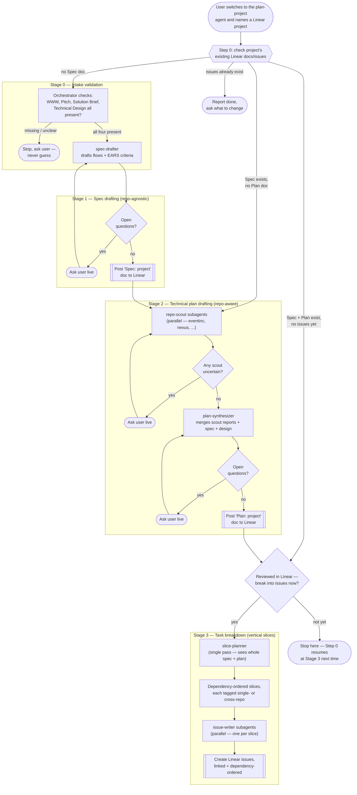

# Planning Workflow — Agent Orchestration

This directory holds the first stage (`Planning`) of a larger agentic dev pipeline (`Planning -> Implementation`, with `Clarification`/`Validation` to follow later, currently out of scope). It turns a Linear project — carrying four human-authored docs (WWW, Pitch, Solution Brief, Technical Design) — into a fully-resolved spec, a fully-resolved cross-repo technical plan, and a dependency-ordered set of vertical-slice Linear issues.

It follows a spec-driven planning discipline (constitution → spec → plan → tasks): every ambiguity is surfaced as an explicit question and resolved live, in conversation, before anything is posted to Linear — never guessed, never deferred to implementation time.

## How it's invoked

There's a single entry point: **`plan-project`**, a `mode: primary` OpenCode agent (not a slash command). Tab-cycle into it (or your configured `switch_agent` keybind), then name or link a Linear project. It re-inspects that project's existing Linear docs/issues every time you engage it, so there's no separate "continue" step to remember — the same agent picks up wherever that specific project left off.

## Orchestration diagram

## Summary

**`plan-project`** (the only primary agent here) is the sole orchestrator. It owns all Linear reads/writes and all conversation with the user; the five subagents below never touch Linear or talk to the user directly — they're pure reasoning agents that take content in and return a draft plus a list of open questions.

1. **Step 0 — resume detection.** Every engagement starts by checking what already exists in Linear for that project (Spec doc? Plan doc? Issues?), not by assuming a fresh run. This is what replaced having two separate entry points.
2. **Stage 0 — intake validation.** The orchestrator itself (no subagent) confirms all four required docs exist. Missing or unclear → hard stop, ask the user.
3. **Stage 1 — spec drafting.** `spec-drafter` is deliberately repo-agnostic: it only knows WWW/Pitch/Solution Brief, and produces user flows with EARS acceptance criteria ("When [trigger], the system shall [behavior]"). Any open question is asked live; the agent redrafts and re-checks until there are none, only then posting the Spec doc to Linear.
4. **Stage 2 — technical plan drafting.** One `repo-scout` per configured repo (today: `eventinc`, `nexus`) runs in parallel, each reading only its own repo's constitution (`AGENTS.md`/`.agents/rules`) to judge relevance — never guessing, always flagging uncertainty as a question. Once every scout is resolved, `plan-synthesizer` merges their reports with the spec and Technical Design into one cross-repo plan, under the same ask-until-resolved loop, before it's posted to Linear.
5. **Approval gate.** Before task breakdown, the orchestrator asks for an explicit go-ahead — either right after posting the plan, or the next time it's engaged (via Step 0). This is a live question, not an automated check of Linear's state.
6. **Stage 3 — task breakdown.** `slice-planner` runs once over the *entire* resolved spec + plan (not fanned out per repo) specifically so it can catch a vertical slice that genuinely needs changes in both `eventinc` and `nexus` and keep it as **one** issue instead of splitting it by repo. Only after slices are fixed does `issue-writer` fan out safely in parallel, one per slice, formatting each into a Linear issue that references the Spec/Plan docs instead of duplicating their content.

### Agents at a glance

| Agent | Mode | Role | Notable permissions |
|---|---|---|---|
| `plan-project` | `primary` | Orchestrator: all Linear I/O, all user conversation, drives Stages 0–3 | `edit`/`bash` denied — never touches code |
| `spec-drafter` | `subagent` | Drafts/refines the repo-agnostic spec (Stage 1) | `edit`/`bash`/`task`/`webfetch`/`websearch` denied — pure drafting |
| `repo-scout` | `subagent` | Judges one repo's relevance (Stage 2, fanned out per repo) | Only subagent with `read`/`glob`/`grep` allowed |
| `plan-synthesizer` | `subagent` | Merges scout reports into the cross-repo plan (Stage 2) | Same restricted set as `spec-drafter` |
| `slice-planner` | `subagent` | Single-pass vertical-slice breakdown (Stage 3) | Same restricted set as `spec-drafter` |
| `issue-writer` | `subagent` | Formats one slice into a Linear issue (Stage 3, fanned out per slice) | Same restricted set as `spec-drafter` |

### Design principles

- **Ask, never guess** — extends the workspace root [`AGENTS.md`](../AGENTS.md)'s existing rule to every stage: any subagent that can't confidently resolve something raises it as an explicit question instead of filling the gap.
- **Spec before plan** — *what* the system does (repo-agnostic) is fully resolved before *how/where* it's built (repo-aware) is even considered.
- **Vertical slices, not layers or repos** — Stage 3 slices by user-flow value; a slice spanning both repos stays one issue, never split for the sake of parallelism.
- **Centralized I/O** — only the primary agent talks to Linear or the user; subagents are stateless drafting functions.
- **Stateful via Linear, not via memory** — the workflow's "state" is just what's already posted in Linear, so any session can resume it correctly.

### Out of scope (for now)

- `Clarification` and `Validation` pipeline stages.
- Automatic approval detection (e.g. polling Linear comments) — the approval gate is a live question today.
- Triggering `plan-project` from a Linear mention — noted as a future direction, not yet wired up.
